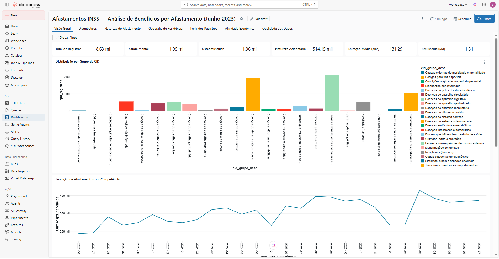
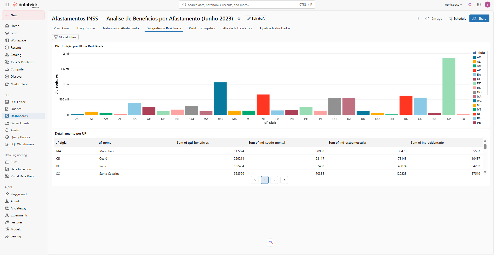

# afastamento-trabalho-inss

Pipeline de dados no Databricks para análise de afastamentos do trabalho utilizando microdados públicos do INSS.

## Resultados em Destaque

Período dos indicadores: **jul/2023 a jul/2026** (37 competências) | Total: **11.531.845 registros de afastamento** (auxílio-doença, espécies 31 e 91)

| Indicador | Valor |
| --- | --- |
| Grupo CID mais frequente — Lesões e consequências de causas externas | 2.777.752 (24,1%) |
| Doenças osteomusculares | 2.771.959 (24,0%) |
| Transtornos mentais e comportamentais | 1.478.967 (12,8%) |
| Natureza acidentária (auxílio-doença acidentário, espécie 91) | 654.244 (5,7%) |
| Duração média do benefício | 111 dias |
| RMI média | 1,32 salários-mínimos |
| UF com maior volume — São Paulo | 2.499.169 (21,7%) |
| Afastamentos sem CID informado | 735.443 (6,4%) |

> Os três maiores grupos de CID somam cerca de 61% do total. São Paulo concentra 21,7% dos registros. Sobre os afastamentos com CID informado, os transtornos mentais representam 13,7%.

> **Observações:** a duração média considera os 11,4 milhões de registros com data de cessação informada. "Afastamento" não inclui auxílio-acidente (espécies 36, 94 e 95) nem aposentadoria por invalidez. A competência jun/2023 ainda não está nestes números e será incluída na próxima execução completa no Databricks. Os prints abaixo são da execução anterior e serão atualizados.

### Imagens





## Objetivo

Construir um pipeline de dados no Databricks para analisar os benefícios concedidos pelo INSS, com foco nos registros classificados como afastamento.

O projeto compara diagnósticos associados a transtornos mentais e doenças osteomusculares por características previdenciárias, demográficas, geográficas e, quando disponível, econômicas.

> **Nota metodológica:** Os resultados representam **registros de benefícios** e não pessoas ou trabalhadores únicos. Indicadores por CNAE consideram somente o subconjunto com atividade econômica informada.

## Fonte dos Dados

Os microdados utilizados neste projeto foram obtidos manualmente a partir do portal de Dados Abertos do Governo Federal ([dados.gov.br](https://dados.gov.br/dados/organizacoes/visualizar/instituto-nacional-do-seguro-social)), especificamente do conjunto de dados de benefícios concedidos pelo INSS.

A coleta **não foi automatizada** devido à indisponibilidade da API no momento da criação do pipeline. O download foi realizado de forma manual e os 38 arquivos CSV (um por competência) foram carregados diretamente na camada Bronze do pipeline.

> **Nota:** Quando a API dos Dados Abertos estiver disponível, recomenda-se substituir a ingestão manual por um processo automatizado (ex.: Auto Loader ou job agendado) para garantir atualizações periódicas e rastreabilidade.

## Arquitetura

```
CSV (Dados Abertos)
    │
    ▼
Bronze  →  ingestão bruta
    │
    ▼
Silver  →  limpeza + regras de negócio
    │
    ▼
Gold    →  modelo estrela (1 fato + 5 dimensões)
    │
    ▼
Dashboard AI/BI  →  7 páginas analíticas
```

### Tabelas Gold (Unity Catalog)

| Entidade | Tabela UC |
| --- | --- |
| Fato | `afastamento_inss.gold.fato_afastamentos` |
| Dimensão Tempo | `afastamento_inss.gold.dim_tempo` |
| Dimensão CID | `afastamento_inss.gold.dim_cid` |
| Dimensão Espécie | `afastamento_inss.gold.dim_especie` |
| Dimensão Geografia | `afastamento_inss.gold.dim_geografia` |
| Dimensão Atividade | `afastamento_inss.gold.dim_atividade` |

## Tecnologias

- Databricks
- Delta Lake
- PySpark
- Spark SQL
- AI/BI Dashboards (relationship graph)

## Dashboard

O projeto inclui um dashboard AI/BI publicado no Databricks, com:

- **Relationship graph** conectando a tabela fato (`fato_afastamentos`) a 5 dimensões via chaves surrogate
- **7 páginas analíticas:** Visão Geral, Diagnósticos, Natureza do Afastamento, Geografia de Residência, Perfil dos Registros, Atividade Econômica e Qualidade dos Dados

### Decisões de Modelagem

- **Chaves surrogate determinísticas** com `sha2` (não `monotonically_increasing_id`), garantindo idempotência entre execuções
- **Membro "NI"** em todas as dimensões, assegurando integridade referencial mesmo sem correspondência na fonte
- **Validação de colunas obrigatórias** na entrada do notebook 05
- **Leitura com `inferSchema=false`** para preservar zeros à esquerda dos códigos (ex.: CBO, CNAE)

## Como Reproduzir

1. Baixe o dataset de benefícios concedidos pelo INSS em [dados.gov.br](https://dados.gov.br/dados/organizacoes/visualizar/instituto-nacional-do-seguro-social)
2. Coloque o arquivo CSV em `/Volumes/afastamento_inss/bronze/raw/`
3. Execute os notebooks na ordem:

| Ordem | Notebook | Tabela de Saída |
| --- | --- | --- |
| 0 | `00_exploracao` *(opcional)* | — |
| 1 | `01_bronze_ingestao` | `afastamento_inss.bronze.beneficios_concedidos` |
| 2 | `02_silver_staging` | `afastamento_inss.silver.stg_beneficios_concedidos` |
| 3 | `03_silver` | `afastamento_inss.silver.beneficios_concedidos` |
| 4 | `04_gold_prep_bi` | preparação Gold |
| 5 | `05_gold_modelo_analitico` | modelo estrela Gold (1 fato + 5 dimensões) |
| 6 | `06_analise_visualizacao` | análises e visualizações |

> **Nota:** O dataset cobre 38 competências consecutivas (jun/2023 a jul/2026), permitindo análises temporais e comparativos ano a ano.
